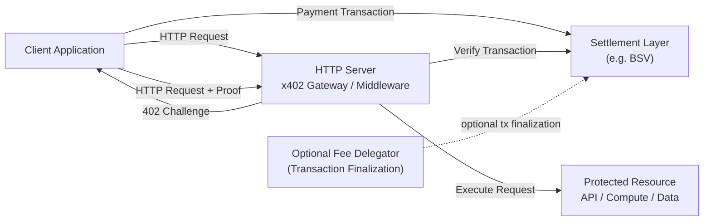

# x402 Architecture

## Components

### Client

The client performs the following actions:

• receives the challenge
• constructs the settlement transaction
• retries the request with proof

### Server (x402 Gateway)

The server:

• issues settlement challenges
• verifies payment proofs
• validates transaction requirements
• executes the request when proof is valid

### Settlement Layer

The settlement layer provides:

• transaction validation
• double-spend protection
• replay protection via UTXO spending

### Optional Fee Delegator

In fee-delegated deployments:

• the client constructs a partial transaction
• a delegator finalizes the miner fee inputs
• the finalized transaction is returned to the client

The client still submits the proof to the server.

This component is **optional and does not change protocol semantics**.
