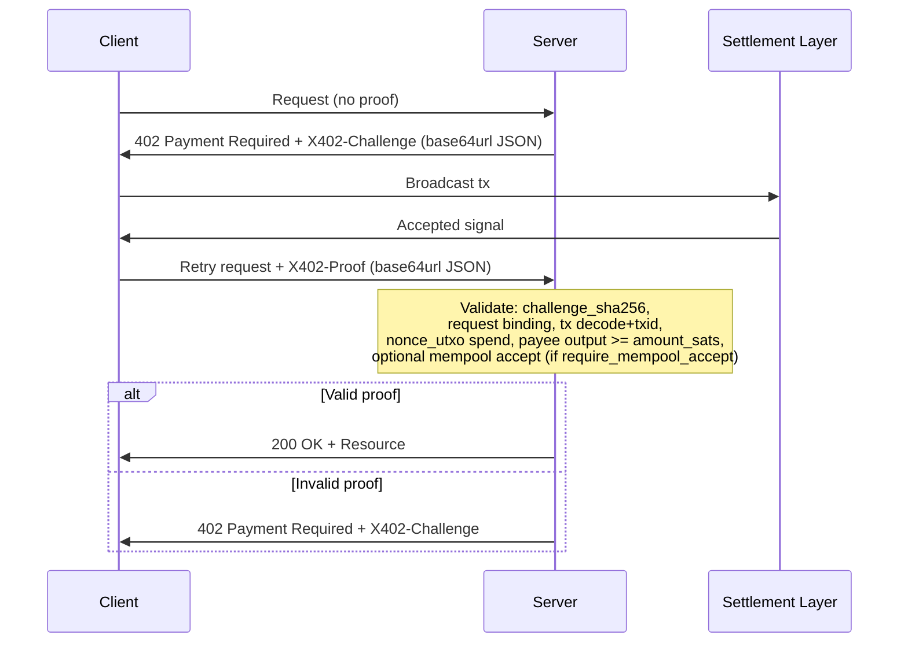

# x402 Protocol Flow

```mermaid
sequenceDiagram
    participant Client
    participant Server
    participant Settlement Layer

    Client->>Server: Request (no proof)
    Server->>Client: 402 Payment Required + X402-Challenge (base64url JSON)

    Client->>Settlement Layer: Broadcast tx
    Settlement Layer->>Client: Accepted signal

    Client->>Server: Retry request + X402-Proof (base64url JSON)

    Note over Server: Validate: challenge_sha256,<br/>request binding, tx decode+txid,<br/>nonce_utxo spend, payee output >= amount_sats,<br/>optional mempool accept (if require_mempool_accept)

    alt Valid proof
        Server->>Client: 200 OK + Resource
    else Invalid proof
        Server->>Client: 402 Payment Required + X402-Challenge
    end
```
