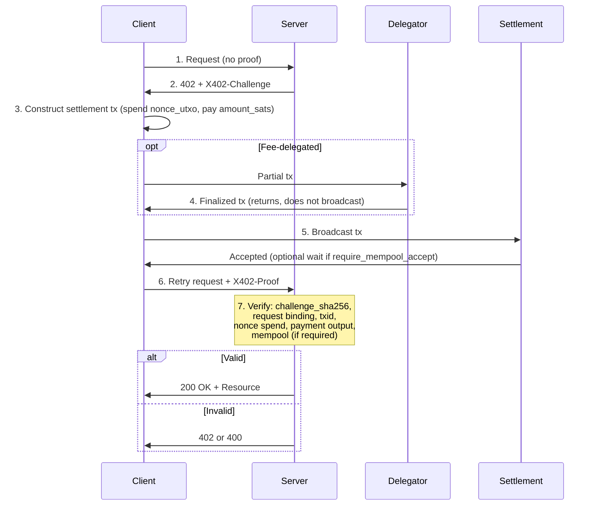

# x402 Protocol Flow

This document explains the end-to-end x402 flow. The canonical specification is [spec/x402.md](../spec/x402.md). This page is explanatory; normative rules are in the spec.

## 1. Initial Request (No Proof)

The client sends an HTTP request for a protected resource without an `X402-Proof` header. The request includes method, path, query, headers, and body as usual. The server determines that payment is required and will respond with 402.

## 2. 402 Response + X402-Challenge

The server responds with HTTP 402 Payment Required and includes an `X402-Challenge` header. The header value is base64url-encoded JSON (the challenge object). Per spec Section 4, the server MUST include exactly one `X402-Challenge` header when payment is required and no valid proof is present.

The challenge defines the settlement conditions: `amount_sats`, `payee_locking_script_hex`, `nonce_utxo`, request binding fields (method, path, query, header hash, body hash), `expires_at`, and `require_mempool_accept`.

## 3. Client Constructs Settlement Transaction

The client decodes the challenge, parses the JSON, and constructs a payment transaction. The transaction MUST spend the `nonce_utxo` (spec Section 6) and MUST include an output that pays at least `amount_sats` to `payee_locking_script_hex`. The client is responsible for the payment logic.

## 4. Optional Fee Delegation

In fee-delegated deployments, the client sends the partial transaction to a delegator. The delegator finalizes miner-fee inputs and returns the completed transaction to the client. The delegator does not broadcast; the client receives the finalized transaction and proceeds to broadcast it. See [deployment-modes.md](deployment-modes.md).

## 5. Client Broadcasts Transaction

The client broadcasts the payment transaction to the settlement layer. If `require_mempool_accept` is true in the challenge, the client may need to wait for mempool acceptance (or equivalent) before retrying. The protocol does not specify the client–settlement-layer interaction; that is deployment-specific.

## 6. Client Retries Request with X402-Proof

The client computes `challenge_sha256` from the canonical JSON of the challenge (spec Section 5). It builds the proof object with `challenge_sha256`, the request binding fields, and the payment (txid, rawtx_b64). It base64url-encodes the proof and adds it as the `X402-Proof` header. The client retries the original request with the same method, path, query, headers, and body—only the proof header is added. Per spec Section 3, the client MUST include a valid `X402-Proof` when retrying with settlement proof.

## 7. Server Verification

The server runs the verification procedure (spec Section 7):

- Decode the proof object.
- Verify the challenge reference: `challenge_sha256` matches SHA256 of the canonical challenge bytes.
- Validate request binding: method, path, query, header hash, and body hash match the proof and the actual request.
- Check expiration: current time must not exceed `expires_at`.
- Decode the transaction and verify `txid` matches the computed hash.
- Verify the nonce UTXO is spent: an input outpoint exactly matches `nonce_utxo` (txid, vout).
- Verify the payment output: at least `amount_sats` paid to `payee_locking_script_hex`.
- If `require_mempool_accept` is true, verify the transaction has been accepted to the mempool (or equivalent signal).

If all checks pass, the server executes the request and returns the resource. If any check fails, the server returns 402 or 400 per spec Section 9.

## Sequence Diagram

